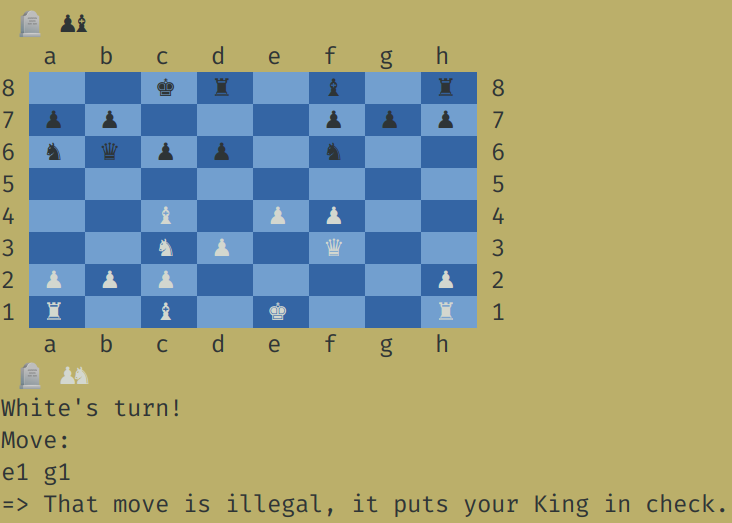

# Chess

A command line Chess game where two players can play against each other. This was my final project for [The Odin Project's](https://www.theodinproject.com) Ruby section.

## Usage

This version:

--uses the [colorize](https://github.com/fazibear/colorize) gem to ouput the board in color. The colors I have chosen may not show up properly depending on your terminal color configurations. For testing, I used a dark sandy colored background, as displayed in the screenshot below.

--follows the common rules of Chess. It does not allow a player to make an illegal move such as one that would put their king in check, or neglect to guard a king who is in check. 
It implements the special moves *en passant* and *castling*.

--does not implement pre-determination of *mate*. When a player is in check and cannot make a move to remove the check, the turn goes to their opponent who must take their king for the game to end.

--does not call a *stalemate*. If a stalemate is reached, the players must recognize it and quit the game.

## Reflections

Though I still have design improvements and additional features in mind, there comes a time to 'take the roast out of the oven', that is to say: calling the current version 'done'. With much more to learn on the Odin journey, further work on this project will have to wait for version 2, as time permits.  

With that said, I do think this version is a pretty fair representation of my Ruby skills at this point. My object-oriented design has improved immensely since previous projects, with less unnecessary dependencies and more adaptability. I successfully implemented an abstract class and extended classes with modules to keep this relatively larger library well-organized and DRY. It's by no means perfect in any of these regards, but an indication of my growth and closer to where i'd like to be.

Semi-regretfully, I did miss some opportunites with this project to implement a node-based data structure and search algorithms. That approach would have made this project more impressive, but it was not fitting in with the way my brain was envisioning this project. At first I tried to alter the course my brainstorming was taking, thinking I needed to do things a certain 'respectable' way, but eventually I let those ideas go in favor of allowing my creativity to flow. This approach proved much more efficient, and practical in my learning journey as well-- as ideas led to interesting experiments, which in turn led to deeper knowledge of the Ruby language and programming concepts in general.